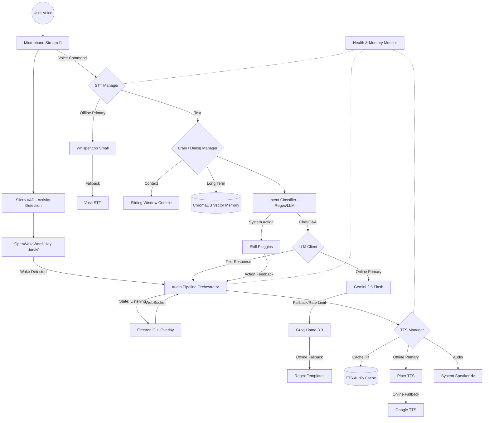

# Voice Assistant Architecture

Below is the high-level architecture of the voice assistant system, depicting the flow from audio input to generating an action/response through the hybrid engine. 

## System Overview

The system runs a **headless Python backend** that communicates via WebSocket with an **Electron-based transparent overlay GUI**. It uses an event-driven state machine managed by the `AudioPipeline`.

## Modular Breakdown

- **Core Pipeline**: Finite state machine transitions across Sleeping → Wake Detected → Listening → Processing → Speaking.
- **Audio Module**: `sounddevice` input stream with energy-based Barge-in (interruption) detection.
- **Brain Layer**: Combines short-term sliding context (`ContextManager`) with long-term semantic retrieval (`VectorMemory` via ChromaDB).
- **Skill Engine**: Dynamically loaded plugins via `SkillLoader` with safe execution boundaries (`BaseSkill.safe_execute()`).
- **GUI Bridge**: Asyncio WebSocket server broadcasting JSON state events to the Electron renderer process.
- **Health Monitor**: Actively polls `psutil`. If RAM exceeds the configurable 3GB soft limit, it forces GC and unloads inactive text-to-speech or speech-to-text models.

## Dependencies

- **Platform Agnostic**: `core.platform` abstracts Windows/macOS specific functionalities (like screen brightness or media keys).
- **Zero Configuration DB**: SQLite handles fast reminders/alarms while ChromaDB handles semantic memory locally.
- **Free APIs**: Open-Meteo & DuckDuckGo require zero authentication for weather/news. Gemini & Groq provide highly generous free LLM tiers.
