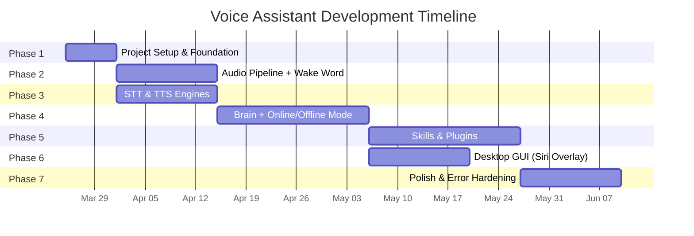

# Voice Based Virtual Assistant — Detailed Task List

> Estimated total: **12–16 weeks** for a single developer
> Constraints: **Free APIs only** · **Mac + Windows** · **M1 8GB RAM** · **Wake word activation** · **Online + Offline** · **Error handling**

---

## Phase 1 · Project Setup & Foundation *(Week 1)*

| # | Task | Est. Time | Dependencies |
|---|---|---|---|
| 1.1 | Initialize Git repo, `.gitignore`, `README.md` | 1 hr | — |
| 1.2 | Create directory structure (incl. `core/platform/` for Mac/Win) | 1 hr | 1.1 |
| 1.3 | Set up Python venv, `pyproject.toml`, `requirements.txt` | 1 hr | 1.2 |
| 1.4 | Create `config/settings.yaml` — RAM limits, wake word config, online/offline toggle | 2 hr | 1.2 |
| 1.5 | Implement `utils/logger.py` — structured logging with rotation | 2 hr | 1.3 |
| 1.6 | Implement `utils/secrets.py` — `keyring` (Mac Keychain / Win Credential Locker) | 2 hr | 1.3 |
| 1.7 | Implement `core/platform/` — OS detection, `mac.py`, `windows.py` | 3 hr | 1.3 |
| 1.8 | Implement `utils/network.py` — connectivity checker (online/offline detection) | 2 hr | 1.3 |
| 1.9 | Implement global error handler — top-level try/catch, crash recovery | 2 hr | 1.5 |
| 1.10 | Write cross-platform setup: `setup.sh` (Mac) + `setup.bat` (Win) + `run.py` | 2 hr | 1.3 |
| 1.11 | Set up pytest, `conftest.py`, CI-friendly test structure | 1 hr | 1.3 |
| 1.12 | Register for free API keys: Gemini (AI Studio), Groq, NewsAPI | 1 hr | — |

> **Milestone**: Cross-platform skeleton with config, logging, network detection, and error infrastructure.

---

## Phase 2 · Core Audio Pipeline + Wake Word *(Weeks 2–3)*

| # | Task | Est. Time | Dependencies |
|---|---|---|---|
| 2.1 | Implement `core/audio/microphone.py` — `sounddevice` (CoreAudio / WASAPI) | 4 hr | Phase 1 |
| 2.2 | Add mic error handling — device not found, permission denied, retry loop | 2 hr | 2.1 |
| 2.3 | Add Voice Activity Detection using Silero VAD (free, ~2 MB) | 4 hr | 2.1 |
| 2.4 | Implement `core/audio/wake_word.py` — OpenWakeWord (always-listening loop) | 6 hr | 2.1 |
| 2.5 | Add wake word error handling — model load failure → keyboard/button fallback | 2 hr | 2.4 |
| 2.6 | Implement state machine: Sleeping → WakeDetected → Listening → Processing → Speaking | 6 hr | 2.4, 2.3 |
| 2.7 | Add immediate chime response on wake word (<100ms before STT starts) | 2 hr | 2.6 |
| 2.8 | Implement multi-turn listening — stay active 3s after responding for follow-ups | 3 hr | 2.6 |
| 2.9 | Implement "cancel" command — stops currently running command/action | 2 hr | 2.6 |
| 2.10 | Implement "bye" command — ends conversation, returns to sleep | 2 hr | 2.6 |
| 2.10 | Implement `core/audio/barge_in.py` — interrupt-while-speaking → re-enter Listening | 4 hr | 2.6 |
| 2.11 | Implement `core/audio/audio_utils.py` — resampling, format conversion | 3 hr | 2.1 |
| 2.12 | Add audio feedback sounds — wake chime, processing indicator, error sound | 2 hr | 2.6 |
| 2.13 | Test full wake word → listen → timeout cycle on both macOS and Windows | 3 hr | All above |

> **Milestone**: Say wake word → chime plays → assistant listens → handles errors → both OSes.

---

## Phase 3 · Speech-to-Text & Text-to-Speech *(Weeks 3–4)*

| # | Task | Est. Time | Dependencies |
|---|---|---|---|
| 3.1 | Define `core/stt/engine.py` — abstract STT interface | 2 hr | Phase 2 |
| 3.2 | Implement `core/stt/whisper_stt.py` — Whisper.cpp `small` model (offline) | 6 hr | 3.1 |
| 3.3 | Implement `core/stt/vosk_stt.py` — Vosk `small` model (offline fallback) | 4 hr | 3.1 |
| 3.4 | Add STT error chain: Whisper fail → retry → Vosk → "I didn't catch that" | 3 hr | 3.2, 3.3 |
| 3.5 | Add silence timeout handling — "I didn't hear anything" → return to sleep | 2 hr | 3.4 |
| 3.6 | Define `core/tts/engine.py` — abstract TTS interface | 2 hr | Phase 2 |
| 3.7 | Implement `core/tts/piper_tts.py` — Piper (offline primary, ~100 MB) | 5 hr | 3.6 |
| 3.8 | Implement `core/tts/gtts_tts.py` — gTTS fallback (online, free) | 3 hr | 3.6 |
| 3.9 | Add TTS error chain: Piper fail → gTTS → system `say` cmd → GUI text only | 3 hr | 3.7, 3.8 |
| 3.10 | Add TTS audio caching to disk | 2 hr | 3.7, 3.8 |
| 3.11 | Build "echo test": wake → STT → TTS loop with full error handling | 3 hr | 3.1–3.10 |
| 3.12 | Test all models on macOS M1 (verify RAM < 2 GB total) | 2 hr | 3.1–3.10 |
| 3.13 | Test all models on Windows | 2 hr | 3.1–3.10 |

> **Milestone**: Speak → hears → speaks back, with graceful error fallbacks, both OSes, < 2 GB RAM.

---

## Phase 4 · Brain Layer — Conversational AI *(Weeks 5–7)*

| # | Task | Est. Time | Dependencies |
|---|---|---|---|
| 4.1 | Implement `core/brain/llm_client.py` — Gemini free + Groq free abstraction | 5 hr | Phase 1 |
| 4.2 | Add LLM error chain: Gemini 429 → Groq → regex fallback → "I'm having trouble" | 4 hr | 4.1 |
| 4.3 | Add rate-limit tracking (250 RPD Gemini, 1000 RPD Groq) with quota warnings | 3 hr | 4.1 |
| 4.4 | Create `config/prompts.yaml` — system prompts, persona, safety guardrails | 3 hr | 4.1 |
| 4.5 | Implement `core/brain/context.py` — sliding context window | 4 hr | 4.1 |
| 4.6 | Implement `core/brain/memory.py` — ChromaDB vector memory (free) | 6 hr | 4.1 |
| 4.7 | Implement `core/brain/intent_classifier.py` — hybrid LLM + regex | 6 hr | 4.1 |
| 4.8 | Implement **offline intent engine** — regex patterns for known commands | 5 hr | 4.7 |
| 4.9 | Add pre-built response templates for offline mode common queries | 3 hr | 4.8 |
| 4.10 | Implement `core/brain/dialog_manager.py` — conversation state machine | 8 hr | 4.5, 4.6, 4.7 |
| 4.11 | Integrate online/offline mode switching — auto-detect + manual toggle | 4 hr | 4.10, 1.8 |
| 4.12 | Connect dialog manager to STT input and TTS output | 4 hr | 4.10, Phase 3 |
| 4.13 | Add multi-turn conversation support (follows wake word state machine) | 4 hr | 4.10 |
| 4.14 | Implement emotional tone detection (basic sentiment) | 4 hr | 4.10 |
| 4.15 | Implement proactive suggestions engine | 4 hr | 4.10 |
| 4.16 | Build `core/pipeline.py` — full end-to-end orchestrator with error recovery | 6 hr | All above |
| 4.17 | Test online mode → offline mode → back to online transition | 3 hr | 4.11 |
| 4.18 | Test on both OSes, verify API quota handling and error chains | 4 hr | All above |

> **Milestone**: Full conversational assistant — online LLM + offline fallback, auto-switching, both OSes.

---

## Phase 5 · Skills & Plugins *(Weeks 7–10)*

| # | Task | Est. Time | Dependencies |
|---|---|---|---|
| 5.1 | Define `skills/base_skill.py` — skill interface with `is_offline_capable` flag | 4 hr | Phase 4 |
| 5.2 | Add per-skill error wrapping — catch exceptions, log, TTS "I couldn't do that" | 3 hr | 5.1 |
| 5.3 | **System Control** — cross-platform: AppleScript (Mac) / PowerShell (Win) | 8 hr | 5.1, 1.7 |
| 5.4 | **Web Search** — DuckDuckGo `ddgs` (free) + LLM summary · offline: "Need internet" | 5 hr | 5.1 |
| 5.5 | **Calendar & Reminders** — local SQLite, timers, alarms · works offline ✅ | 6 hr | 5.1 |
| 5.6 | **Media Player** — cross-platform OS commands · works offline ✅ | 6 hr | 5.1, 1.7 |
| 5.7 | **Image Generation** — Gemini free tier · offline: "Need internet" | 4 hr | 5.1 |
| 5.9 | **Code Assistant** — Gemini/Groq free · offline: "Need internet" | 4 hr | 5.1 |
| 5.10 | **News & Weather** — NewsAPI + Open-Meteo · offline: "Need internet" | 4 hr | 5.1 |
| 5.11 | **Translation** — Argos Translate (offline-capable) ✅ | 5 hr | 5.1 |
| 5.12 | **Custom Skill Loader** — dynamic plugin system with error isolation | 6 hr | 5.1 |
| 5.13 | Wire all skills into dialog manager with online/offline routing | 4 hr | 5.2–5.12 |
| 5.14 | Test all skills on both macOS and Windows (online + offline modes) | 6 hr | 5.2–5.12 |

> **Milestone**: 10+ skills, each with error handling and offline awareness, both OSes.

---

## Phase 6 · Desktop GUI — Siri-Like Transparent Overlay *(Weeks 10–12)*

| # | Task | Est. Time | Dependencies |
|---|---|---|---|
| 6.1 | Scaffold Electron app with `frame: false`, `transparent: true`, `alwaysOnTop: true` | 4 hr | — |
| 6.2 | Build Python ↔ Electron IPC bridge (`gui/bridge.py`) via WebSocket | 6 hr | 6.1, Phase 4 |
| 6.3 | Implement **glowing orb** — CSS radial gradient + `box-shadow` + professional light theme | 6 hr | 6.1 |
| 6.4 | Build 7-state orb animation system (Sleeping → Wake → Listening → Processing → Speaking → Error → Offline) | 6 hr | 6.3 |
| 6.5 | Implement **frosted glass text pill** — light theme, `backdrop-filter: blur()`, soft shadows | 3 hr | 6.1 |
| 6.6 | Build **waveform visualizer** — Canvas + Web Audio API, reacts to mic input | 4 hr | 6.1 |
| 6.7 | Implement click-through transparent regions (`setIgnoreMouseEvents`) | 3 hr | 6.1 |
| 6.8 | Add orb drag-to-reposition functionality | 2 hr | 6.3 |
| 6.9 | Build **settings panel** — separate frosted-glass popup window | 5 hr | 6.1 |
| 6.10 | Add system tray integration + keyboard shortcut (`Cmd/Ctrl+Space`) | 3 hr | 6.1 |
| 6.11 | Implement online/offline mode indicator (orb amber tint + badge) | 2 hr | 6.4 |
| 6.12 | Add error notification toasts + chat history expansion | 3 hr | 6.5 |
| 6.13 | Add GUI auto-restart on frontend crash (backend continues headless) | 2 hr | 6.2 |
| 6.14 | Test transparent overlay on both macOS and Windows | 4 hr | All above |

> **Milestone**: Siri-like transparent floating orb with state animations, frosted glass text, and waveform — both OSes.

---

## Phase 7 · Polish, Error Hardening & Documentation *(Weeks 12–14+)*

| # | Task | Est. Time | Dependencies |
|---|---|---|---|
| 7.1 | Implement `utils/cache.py` — LRU response caching (saves API quota) | 3 hr | Phase 4 |
| 7.2 | Add health monitoring — RAM tracking, enforce <4 GB ceiling, auto-unload models | 4 hr | All |
| 7.3 | Add rate-limit dashboard — show Gemini/Groq quota usage in GUI | 2 hr | 4.3 |
| 7.4 | Harden security — audit key handling via `keyring` | 2 hr | All |
| 7.5 | Implement graceful shutdown — save state, flush logs, clean temp files | 3 hr | All |
| 7.6 | **Error handling audit** — test every error scenario from the error table | 4 hr | All |
| 7.7 | **Offline mode stress test** — disconnect network, verify full offline operation | 3 hr | All |
| 7.8 | **Online ↔ offline transition test** — rapid switching, verify no state corruption | 3 hr | All |
| 7.9 | Performance profiling on M1 8GB (ensure no memory spikes) | 4 hr | All |
| 7.10 | Write `README.md` with cross-platform setup guide + offline usage guide | 3 hr | All |
| 7.11 | Create architecture documentation with diagrams | 3 hr | All |
| 7.12 | Record demo video (show wake word, online mode, offline mode, error recovery) | 3 hr | All |
| 7.13 | Final integration test on both Mac and Windows | 4 hr | All |
| 7.14 | Package: DMG (Mac) + MSI/EXE installer (Windows) | 5 hr | All |

> **Milestone**: Production-ready, error-proof, dual-mode, cross-platform distributable.

---

## Summary Timeline

> **Note**: Phases 2 & 3 can run in **parallel**. Phase 6 can start alongside Phase 5 once the brain layer is stable.

---

## Task Summary

| Phase | Tasks | Focus |
|---|---|---|
| Phase 1 | 12 tasks | Setup, config, platform detection, error infra |
| Phase 2 | 13 tasks | Audio pipeline, wake word, state machine, chimes |
| Phase 3 | 13 tasks | STT (Whisper/Vosk), TTS (Piper/gTTS), error chains |
| Phase 4 | 18 tasks | LLM (Gemini/Groq), dialog, memory, online/offline |
| Phase 5 | 14 tasks | 10+ skills, offline awareness, error wrapping |
| Phase 6 | 14 tasks | Siri-like transparent overlay, orb, waveform |
| Phase 7 | 14 tasks | Caching, health, testing, docs, packaging |
| **Total** | **~98 tasks** | **12–16 weeks** |
